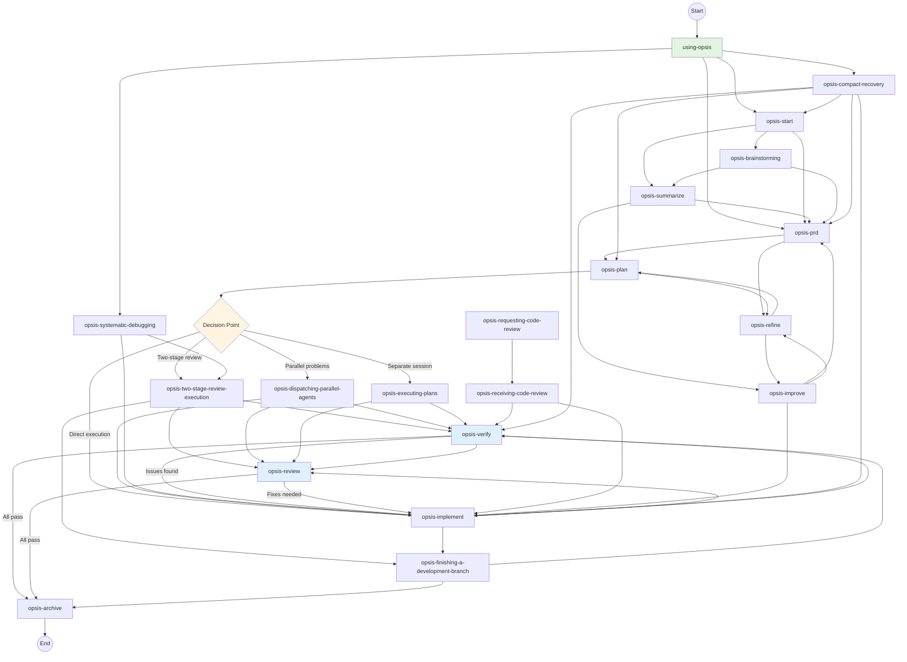

# using-opsis

Meta-skill establishing workflow rules, Iron Laws, and skill invocation order.

## 🚨 Critical: Decision Point Gate Required

**Before taking ANY implementation action after reading tasks.md, you MUST complete the Decision Point Gate template below.**

This is not optional. The Decision Point Gate ensures you:
1. Choose the correct workflow (opsis-implement vs opsis-two-stage-review-execution vs others)
2. Declare the correct mode matching your chosen workflow
3. Invoke the appropriate skill before starting implementation
4. DO NOT skip directly to implementation without workflow guidance

**See "Decision Point Gate" section below for the required template.**

---

## Agent Coordination

**For delegation decisions, use opsis-coordinator** - it provides the complete decision framework for determining when to delegate to subagents vs execute directly.

**Quick reference:**
- Complex analysis (10+ files, multi-directory) → Delegate
- Simple operations (1-2 files, known paths) → Execute directly
- Specialized workflows (PRD, implementation, verification) → Invoke appropriate skill

**For detailed delegation rules, see:**
- **opsis-coordinator** - Complete decision tree and complexity assessment
- **opsis-mode-enforcer** - Mode-specific delegation permissions

---

## The Rule

**Invoke relevant Opsis skills BEFORE any response or action.** Even a 1% chance a skill might apply means you should invoke the skill to check. If an invoked skill turns out to be wrong for the situation, you don't need to use it.

```
User message received
        │
        ▼
"Might any Opsis skill apply?" ──── definitely not ──► Respond normally
        │
        │ yes, even 1%
        ▼
Invoke skill
        │
        ▼
Announce: "Using [skill] to [purpose]"
        │
        ▼
Follow skill exactly
        │
        ▼
Respond (including clarifications)
```

---

## After Activating This Skill

**When you activate `using-opsis`, your next action sequence is:**

```
1. Check for in-progress work: todo---get_items
2. If continuing work:
   ├─→ Read tasks.md to understand current position
   ├─→ Complete Decision Point Gate (see below)
   └─→ Invoke chosen skill IMMEDIATELY
3. If starting new work:
   ├─→ Determine appropriate skill based on task type
   ├─→ Complete Decision Point Gate if implementation work
   └─→ Invoke chosen skill IMMEDIATELY
```

**🚨 CRITICAL: After activating this skill, DO NOT:**
- ❌ Start implementing directly without invoking an implementation skill
- ❌ Read files or use power tools for implementation without completing Decision Point Gate
- ❌ Skip the decision template and "just get started"

**✅ You MUST:**
- Complete the Decision Point Gate before any implementation action
- Invoke the chosen skill (opsis-implement, opsis-two-stage-review-execution, etc.)
- Follow the invoked skill's instructions exactly

---

## 🚨 Fail-Safe: Auto-Correction for Protocol Violations

**This fail-safe system detects when you attempt to bypass the workflow and auto-corrects.**

### Detection Triggers

**You are violating the protocol if:**

1. **Direct execution without Decision Point Gate:**
   - You start using `power---file_read`, `power---file_write`, or `power---file_edit`
   - You start executing shell commands with `power---bash`
   - You activated `using-opsis` but didn't complete the Decision Point Gate
   - You didn't invoke an implementation skill (opsis-implement, opsis-two-stage-review-execution, etc.)

2. **Wrong workflow for task context:**
   - User said "all" with >10 tasks, but you're using opsis-implement directly
   - Large task list (>10) but you're implementing without quality gates
   - Bug detected but you're implementing directly instead of debugging

3. **Skipping todo check:**
   - You didn't call `todo---get_items` after activating using-opsis
   - You didn't read tasks.md to understand current position

### Auto-Correction Protocol

**When a violation is detected, you MUST:**

1. **STOP immediately** - Halt the incorrect action
2. **Complete the missing step** - Do what you skipped (Decision Point Gate, todo check, etc.)
3. **Invoke the correct skill** - Use the appropriate implementation skill
4. **Inform the user** - Explain what was corrected and why

### Auto-Correction Examples

**Example 1: Direct execution without Decision Point Gate**

```
❌ WRONG: Agent starts implementing directly
User: "Proceed with Phase 3"
Agent: Activates using-opsis
       ↓
       [Skips Decision Point Gate]
       ↓
       power---bash: mkdir -p src/api
       power---file_write: src/api/user.ts

✅ CORRECTED: Agent detects violation and auto-corrects
I apologize - I was about to start implementation without completing the Decision Point Gate.

Let me follow the correct protocol:

1. Check for in-progress work: todo---get_items
2. Read tasks.md to understand current position
3. Complete Decision Point Gate
4. Invoke chosen skill (opsis-implement or opsis-two-stage-review-execution)

[Completes Decision Point Gate]
[Invokes appropriate skill]
```

**Example 2: Wrong workflow for large task list**

```
❌ WRONG: Agent uses opsis-implement for 54 tasks
User: "Proceed with all tasks"
Agent: Reads tasks.md → 54 tasks
       ↓
       Activates opsis-implement
       ↓
       Starts implementing directly

✅ CORRECTED: Agent detects wrong workflow and auto-corrects
I apologize - I was about to use opsis-implement for 54 tasks.

Let me follow the correct protocol:

Detected: 54 tasks with user scope "all"
Auto-routing: opsis-two-stage-review-execution (large project requires systematic quality gates)

[Invokes opsis-two-stage-review-execution instead]
```

**Example 3: Skipping todo check**

```
❌ WRONG: Agent doesn't check todo list
User: "Continue Phase 3 Task 2"
Agent: Activates using-opsis
       ↓
       [Skips todo---get_items]
       ↓
       Starts reading files

✅ CORRECTED: Agent detects missing todo check
I apologize - I was about to start implementation without checking the current state.

Let me follow the correct protocol:

1. Check for in-progress work: todo---get_items
2. Read tasks.md to understand current position
3. Complete Decision Point Gate
4. Invoke chosen skill

[Checks todo list]
[Reads tasks.md]
[Completes Decision Point Gate]
[Invokes appropriate skill]
```

### Pre-Action Checklist

**Before ANY implementation action, verify:**

- [ ] Did I check `todo---get_items` after activating using-opsis?
- [ ] Did I read tasks.md to understand current position?
- [ ] Did I complete the Decision Point Gate?
- [ ] Did I invoke an implementation skill (opsis-implement, opsis-two-stage-review-execution, etc.)?
- [ ] Did I follow the invoked skill's instructions?
- [ ] Is my workflow choice correct for the task context (task count, user scope)?

**If any answer is NO → STOP and complete the missing step.**

### Detection Pattern

**Watch for these patterns in your own behavior:**

| Pattern | Problem | Correction |
|---------|---------|------------|
| "User said proceed, so I'll start implementing" | Skipping Decision Point Gate | Complete Decision Point Gate first |
| "I'll just implement this task directly" | Not invoking implementation skill | Invoke opsis-implement or appropriate skill |
| "Let me read the files to get started" | Starting implementation without workflow | Stop → Complete Decision Point Gate → Invoke skill |
| "54 tasks, I'll do them one by one" | Wrong workflow for large project | Auto-route to opsis-two-stage-review-execution |
| "I remember what to do from context" | Not reading tasks.md | Read tasks.md to understand current position |

**Example Correct Sequence:**
```
1. User: "Continue Phase 3 Task 2"
2. Agent: Activates using-opsis
3. Agent: Checks todo---get_items → finds Phase 3 Task 2 incomplete
4. Agent: Reads tasks.md to understand task
5. Agent: Completes Decision Point Gate → chooses opsis-implement
6. Agent: Invokes opsis-implement skill
7. Agent: Follows opsis-implement instructions to complete task
```

**Example INCORRECT Sequence (what NOT to do):**
```
1. User: "Continue Phase 3 Task 2"
2. Agent: Activates using-opsis
3. Agent: Checks todo---get_items → finds Phase 3 Task 2 incomplete
4. Agent: Reads tasks.md
5. ❌ Agent starts reading files and implementing code directly
6. ❌ Agent never invoked opsis-implement or opsis-two-stage-review-execution
```

---

## Red Flags - STOP and Check

These thoughts mean STOP—you're rationalizing:

| Thought | Reality |
|---------|---------|
| "This is just a simple question" | Questions are tasks. Check for skills. |
| "I need more context first" | Skill check comes BEFORE clarifying questions. |
| "Let me explore the codebase first" | Skills tell you HOW to explore. Check first. |
| "I can check files quickly" | Files lack conversation context. Check for skills. |
| "Let me gather information first" | Skills tell you HOW to gather information. |
| "This doesn't need a formal skill" | If a skill exists, use it. |
| "I remember this skill" | Skills evolve. Read current version. |
| "This doesn't count as a task" | Action = task. Check for skills. |
| "The skill is overkill" | Simple things become complex. Use it. |
| "I'll just do this one thing first" | Check BEFORE doing anything. |
| "I know what that means" | Knowing the concept ≠ using the skill. Invoke it. |

---

## The Iron Laws

**NO COMPLETION CLAIMS WITHOUT VERIFICATION EVIDENCE**

**NO IMPLEMENTATION DURING PLANNING MODE**

**NO SKILL INVOCATION WITHOUT CONTEXT ANALYSIS**

### Iron Law 1: No Completion Without Verification

```
NO COMPLETION CLAIMS WITHOUT FRESH VERIFICATION EVIDENCE
```

If you haven't run the verification command in this message, you cannot claim it passes.

### Iron Law 2: No Implementation Without Planning

```
NO CODE CHANGES WITHOUT A PLAN OR TASK SPECIFICATION
```

If you're implementing features, there should be a PRD or task list guiding the work.

### Iron Law 3: No Skipping Fix Loops

```
ISSUES FOUND = ISSUES FIXED + RE-VERIFIED
```

If verification found issues, you must fix them AND re-verify. Proceeding without re-verification is forbidden.

---

## Mode Enforcement

**PLANNING MODE** (using-opsis, opsis-start, opsis-prd, opsis-plan, opsis-summarize, opsis-improve, opsis-refine):
- Ask questions, gather requirements, create documents
- DO NOT write application code
- Output: `.aider-desk/opsis/outputs/{project}/full-prd.md`, `quick-prd.md`, `tasks.md` (location determined by worktree detection - see opsis-worktree-utils)

**IMPLEMENTATION MODE** (opsis-implement, opsis-two-stage-review-execution, opsis-dispatching-parallel-agents):
- Write code, execute tasks
- DO NOT ask planning questions
- DO implement features
- **Follow TDD:** See opsis-test-driven-development for RED-GREEN-REFACTOR cycle with mandatory verification

**VERIFICATION MODE** (opsis-verify, opsis-review):
- Assess quality, check requirements coverage
- DO NOT make changes without verification evidence
- **Apply verification gates:** See opsis-verification-before-completion for comprehensive verification methodology

---

## Skill State Machine

The Opsis skill state machine defines valid and invalid transitions between skills. Following these transitions ensures workflow integrity and prevents protocol violations.

### Valid Transitions Diagram



### Invalid Transitions List

These transitions are **FORBIDDEN** and violate the Opsis protocol:

**Planning → Implementation Violations:**
- ❌ `opsis-prd` → `opsis-implement` (missing `opsis-plan`)
- ❌ `opsis-start` → `opsis-implement` (missing `opsis-prd` or `opsis-plan`)
- ❌ `opsis-summarize` → `opsis-implement` (missing `opsis-plan`)
- ❌ `opsis-plan` → `opsis-verify` (implementation not completed)
- ❌ `opsis-refine` → `opsis-implement` (missing `opsis-plan` after refinement)

**Implementation → Planning Violations:**
- ❌ `opsis-implement` → `opsis-prd` (implementation mode cannot switch to planning)
- ❌ `opsis-two-stage-review-execution` → `opsis-prd` (implementation mode cannot switch to planning)
- ❌ `opsis-implement` → `opsis-start` (implementation mode cannot switch to discovery)

**Verification → Implementation Violations (without evidence):**
- ❌ `opsis-verify` → `opsis-archive` (if issues found)
- ❌ `opsis-review` → `opsis-archive` (if fixes needed)

**Mode Boundary Violations:**
- ❌ Any planning skill → Any implementation skill (without `opsis-plan` first)
- ❌ Any implementation skill → Any planning skill (mode cannot reverse)
- ❌ `using-opsis` → Direct file/code operations (must invoke implementation skill)

**Skipping Required Chains:**
- ❌ `opsis-prd` → `opsis-verify` (missing `opsis-plan` and implementation)
- ❌ `opsis-plan` → `opsis-archive` (missing implementation and verification)
- ❌ `opsis-two-stage-review-execution` → `opsis-archive` (missing verification)

**Protocol Bypass Violations:**
- ❌ `using-opsis` → File read/write/edit directly (must complete Decision Point Gate)
- ❌ `using-opsis` → `power---bash` for implementation (must invoke implementation skill)

### Quick Reference Table

| From Skill | Valid Next Skills | Invalid Next Skills |
|------------|-------------------|---------------------|
| **using-opsis** | opsis-start, opsis-prd, opsis-systematic-debugging, opsis-compact-recovery | opsis-implement, opsis-verify, opsis-plan, direct file operations |
| **opsis-start** | opsis-summarize, opsis-prd, opsis-brainstorming | opsis-implement, opsis-plan, opsis-verify |
| **opsis-summarize** | opsis-prd, opsis-improve | opsis-implement, opsis-plan, opsis-verify |
| **opsis-brainstorming** | opsis-summarize, opsis-prd | opsis-implement, opsis-plan, opsis-verify |
| **opsis-prd** | opsis-plan, opsis-refine | opsis-implement, opsis-verify, opsis-archive |
| **opsis-plan** | opsis-implement, opsis-two-stage-review-execution, opsis-dispatching-parallel-agents, opsis-executing-plans, opsis-refine | opsis-verify, opsis-archive, opsis-prd |
| **opsis-implement** | opsis-verify, opsis-review, opsis-finishing-a-development-branch | opsis-prd, opsis-plan, opsis-start, opsis-prd |
| **opsis-two-stage-review-execution** | opsis-verify, opsis-review, opsis-finishing-a-development-branch | opsis-prd, opsis-plan, opsis-implement |
| **opsis-dispatching-parallel-agents** | opsis-implement, opsis-verify, opsis-review | opsis-prd, opsis-plan, opsis-start |
| **opsis-executing-plans** | opsis-verify, opsis-review | opsis-prd, opsis-plan, opsis-implement (direct) |
| **opsis-systematic-debugging** | opsis-implement, opsis-two-stage-review-execution | opsis-prd, opsis-plan, opsis-verify |
| **opsis-verify** | opsis-review, opsis-archive, opsis-implement (if issues) | opsis-prd, opsis-plan, opsis-start |
| **opsis-review** | opsis-archive, opsis-implement (if fixes needed) | opsis-prd, opsis-plan, opsis-start |
| **opsis-requesting-code-review** | opsis-receiving-code-review | opsis-implement, opsis-verify |
| **opsis-receiving-code-review** | opsis-implement, opsis-verify | opsis-prd, opsis-plan |
| **opsis-improve** | opsis-prd, opsis-implement, opsis-refine | opsis-verify, opsis-archive |
| **opsis-refine** | opsis-plan, opsis-improve | opsis-implement, opsis-verify |
| **opsis-finishing-a-development-branch** | opsis-archive, opsis-verify | opsis-prd, opsis-plan, opsis-implement |
| **opsis-compact-recovery** | opsis-start, opsis-prd, opsis-plan, opsis-implement, opsis-verify | opsis-archive (without verification) |
| **opsis-archive** | None (terminal state) | All skills |

### Transition Requirements

**Mode-Based Transitions:**

**Planning Mode → Implementation Mode:**
- **Requirement:** Must complete `opsis-prd` → `opsis-plan` chain
- **Precondition:** Full PRD and tasks.md exist
- **Decision Point:** Complete Decision Point Gate before invoking implementation skill
- **Valid skills:** `opsis-implement`, `opsis-two-stage-review-execution`, `opsis-dispatching-parallel-agents`, `opsis-executing-plans`

**Implementation Mode → Verification Mode:**
- **Requirement:** All tasks in tasks.md must be marked complete
- **Precondition:** Code changes committed or staged
- **Decision Point:** Automatic transition after implementation completion
- **Valid skills:** `opsis-verify`, `opsis-review`

**Verification Mode → Implementation Mode (Fix Loop):**
- **Requirement:** Issues must be documented with evidence
- **Precondition:** Verification report with specific issues
- **Decision Point:** Fix required issues only, no new features
- **Valid skills:** `opsis-implement` (for fixes only)

**Verification Mode → Terminal:**
- **Requirement:** All verification checks must pass
- **Precondition:** Zero issues, full requirements coverage
- **Decision Point:** User confirmation for archiving
- **Valid skills:** `opsis-archive`, `opsis-finishing-a-development-branch`

**Special Transitions:**

**Compact Recovery:**
- **Requirement:** Detected compact or context loss
- **Precondition:** Opsis artifacts exist with incomplete work
- **Mode Determination:** Based on artifact state (PRD incomplete → Planning, Tasks incomplete → Implementation, Tasks complete → Verification)
- **Valid next:** Any skill appropriate to restored mode

**Code Review Flow:**
- **Requirement:** Code review requested or received
- **Precondition:** Code changes exist but not yet merged
- **Decision Point:** User initiates review or responds to feedback
- **Valid transitions:** `opsis-requesting-code-review` → `opsis-receiving-code-review` → `opsis-implement` (for fixes) → `opsis-verify`

**Debugging Flow:**
- **Requirement:** Bug or unexpected behavior detected
- **Precondition:** Reproducible issue exists
- **Decision Point:** Investigation before implementation
- **Valid transitions:** `opsis-systematic-debugging` → `opsis-implement` (if fix needed) → `opsis-verify`

### Activation Logging

When activating any Opsis skill, log the following:

```
[SKILL ACTIVATION]
Skill: {skill-id}
Previous Skill: {previous-skill-id or 'none'}
Mode: {PLANNING/IMPLEMENTATION/VERIFICATION}
Transition: {valid/invalid - reference state machine}
Purpose: {brief description of intent}
```

**Example valid activation:**
```
[SKILL ACTIVATION]
Skill: opsis-implement
Previous Skill: opsis-plan
Mode: IMPLEMENTATION
Transition: valid (opsis-plan → opsis-implement)
Purpose: Execute tasks from Phase 3 implementation plan
```

**Example invalid activation (should be caught):**
```
[SKILL ACTIVATION]
Skill: opsis-implement
Previous Skill: opsis-prd
Mode: IMPLEMENTATION
Transition: INVALID (missing opsis-plan)
⚠️ PROTOCOL VIOLATION: Must complete opsis-plan before implementation
```

### Preconditions

**Before activating any skill, verify:**

**General Preconditions (all skills):**
- [ ] using-opsis has been activated first
- [ ] Mode declaration matches skill type (Planning/Implementation/Verification)
- [ ] Previous skill transition is valid (check state machine)
- [ ] Required artifacts exist (PRD, tasks.md, code, etc.)

**Planning Skill Preconditions:**
- [ ] Not in IMPLEMENTATION or VERIFICATION mode (unless recovering)
- [ ] No incomplete implementation tasks exist
- [ ] User intent is discovery, requirements, or planning

**Implementation Skill Preconditions:**
- [ ] PRD exists and is complete
- [ ] tasks.md exists with implementation plan
- [ ] Decision Point Gate has been completed
- [ ] Mode declaration is IMPLEMENTATION
- [ ] Previous skill was planning or implementation (valid transition)

**Verification Skill Preconditions:**
- [ ] All implementation tasks are complete
- [ ] Code changes are committed or staged
- [ ] Mode declaration is VERIFICATION
- [ ] Previous skill was implementation (valid transition)

### Postconditions

**After completing any skill, verify:**

**Planning Skill Postconditions:**
- [ ] Output file created (full-prd.md, quick-prd.md, tasks.md)
- [ ] File path follows Opsis file protocol
- [ ] TODO list updated with new tasks
- [ ] Mode remains PLANNING

**Implementation Skill Postconditions:**
- [ ] Code changes made and committed
- [ ] TODO items marked complete
- [ ] Verification evidence collected (tests passing, linter clean)
- [ ] Mode transitions to VERIFICATION (if all tasks complete)

**Verification Skill Postconditions:**
- [ ] Verification report generated
- [ ] Issues documented or all-pass confirmed
- [ ] If issues found: Fix loop initiated
- [ ] If all-pass: Ready for archive or branch completion

### Success Metrics

**Planning Phase Success:**
- [ ] PRD approved by user
- [ ] tasks.md generated with complete implementation plan
- [ ] All requirements mapped to specific tasks
- [ ] Task dependencies identified

**Implementation Phase Success:**
- [ ] All tasks in tasks.md marked complete
- [ ] Code compiles without errors
- [ ] Tests pass (0 failures)
- [ ] Linter clean (0 errors)
- [ ] Code committed to branch

**Verification Phase Success:**
- [ ] opsis-verify confirms 100% requirements coverage
- [ ] opsis-review finds no critical issues
- [ ] All verification commands pass with fresh evidence
- [ ] Fix loop completed (if issues were found)

**Overall Workflow Success:**
- [ ] All Iron Laws respected
- [ ] No invalid transitions occurred
- [ ] Mode boundaries maintained
- [ ] Decision Point Gate completed before implementation
- [ ] Verification evidence provided before completion claims

---

## Skill Priority

When multiple skills could apply, use this order:

1. **Exploration skills first** (opsis-start) - for vague ideas needing discovery
2. **Planning skills second** (opsis-prd, opsis-plan) - for structuring requirements
3. **Implementation skills third** (opsis-implement, opsis-two-stage-review-execution, opsis-dispatching-parallel-agents) - for executing tasks
4. **Verification skills always** (opsis-verify) - NEVER skip after implementation

"Let's build X" → opsis-start or opsis-prd first, then opsis-plan, then opsis-implement.
"Fix this bug" → Use opsis-systematic-debugging, then opsis-implement if needed.

---

## Opsis Workflow Map

```
[Vague Idea]
      │
      ▼
opsis-start ──► [Conversation] ──► opsis-summarize
      │                                    │
      │                                    ▼
      │                             [Mini-PRD/Prompt]
      │                                    │
      ▼                                    ▼
opsis-prd ◄───────────────────────────────┘
      │
      │ (uses opsis-coordinator for delegation)
      ▼
[Full PRD + Quick PRD]
      │
      ▼
opsis-plan
      │
      │ (uses opsis-coordinator for delegation)
      ▼
[tasks.md with Implementation Plan]
      │
      ▼
**DECISION POINT: Choose execution strategy**

Ask yourself:
1. Do I want TWO-STAGE REVIEW with fresh subagents (spec compliance + code quality)?
2. Are tasks mostly independent with minimal interdependencies?
3. Do I want to stay in current session (no context switch)?

If **ALL YES** → opsis-two-stage-review-execution
Else → Choose alternative below

Choose implementation strategy:
      │
      ├─→ Two-stage review with fresh task context?
      │   └─→ opsis-two-stage-review-execution (creates subtasks via tasks---create_task, then STOPS - runtime executes with two-stage PARALLEL review)
      │
      ├─→ Multiple independent problems across domains?
      │   └─→ opsis-dispatching-parallel-agents (parallel investigation)
      │
      ├─→ Execute plan in separate session with human checkpoints?
      │   └─→ opsis-executing-plans (batch execution, review checkpoints)
      │
      └─→ Simple direct execution without complex coordination?
      └─→ opsis-implement (direct implementation, optional quality skills)
              │
              ▼
          [Code Changes]
              │ (TDD verification at each step)
              ▼
          opsis-verify
              │
              ├── Issues found? ────────────► Fix Loop
              ▼
          [All Verified]
              │
              ▼
          opsis-archive (optional)
```

---

## Required Skill Chains

These chains are MANDATORY. Do not skip steps.

### Planning → Implementation Chain

```
opsis-prd
    │
    ▼ REQUIRED
opsis-plan
    │
    ▼ REQUIRED
opsis-implement
    │
    ▼ REQUIRED
opsis-verify
```

### 🚨 Decision Point Gate (REQUIRED BEFORE ANY IMPLEMENTATION ACTION)

**You MUST complete this decision template before taking ANY implementation action.**

```
═══════════════════════════════════════════════════════════════════════════════
DECISION POINT GATE - COMPLETE BEFORE PROCEEDING
═══════════════════════════════════════════════════════════════════════════════

TASK INFORMATION:
Task: [task name from TODO or tasks.md]
Context: [continuing from previous session / starting new work]
Phase: [if applicable]

DECISION CRITERIA:
━━━━━━━━━━━━━━━━━━━━━━━━━━━━━━━━━━━━━━━━━━━━━━━━━━━━━━━━━━━━━━━━━━━━━━━━━━━━━━

1. Quality Requirements:
   [ ] Systematic quality gates needed (spec compliance + code quality)
   [ ] Standard implementation with optional quality checks

2. Task Independence:
   [ ] Tasks are mostly independent
   [ ] Tasks have dependencies or are tightly coupled

3. Session Preference:
   [ ] Stay in current session
   [ ] Switch to separate session

4. Review Preference:
   [ ] Two-stage review with fresh task context per task
   [ ] Direct execution with optional review

WORKFLOW DECISION:
━━━━━━━━━━━━━━━━━━━━━━━━━━━━━━━━━━━━━━━━━━━━━━━━━━━━━━━━━━━━━━━━━━━━━━━━━━━━━━

CHOSEN WORKFLOW: [ opsis-two-stage-review-execution / opsis-implement / opsis-executing-plans / opsis-dispatching-parallel-agents ]

REASON: [Explain WHY this workflow based on criteria above]

NEXT ACTION: [Invoke the chosen skill using skills---activate_skill]

MODE DECLARATION:
━━━━━━━━━━━━━━━━━━━━━━━━━━━━━━━━━━━━━━━━━━━━━━━━━━━━━━━━━━━━━━━━━━━━━━━━━━━━━━

MODE: [IMPLEMENTATION / VERIFICATION / PLANNING]
Purpose: [Executing task X via chosen workflow]

═══════════════════════════════════════════════════════════════════════════════

STOP: You may NOT proceed until this template is completed.
DO NOT read files, write code, or use power tools until this is done.
```

### Decision Framework Reference

Use this framework to complete the decision template above:

```
READ tasks.md → DECISION POINT GATE → INVOKE CHOSEN SKILL
                      │
         ┌────────────┴────────────┐
         │                         │
    Want TWO-STAGE             Want DIRECT
    REVIEW with fresh          EXECUTION without
    subtasks per task?         complex coordination?
         │                         │
         ▼                         ▼
opsis-two-stage-review-      opsis-implement
execution                    (or opsis-executing-plans
                             for separate session)
```

**Quick Decision Guide:**

| Criteria | Value → Workflow |
|----------|------------------|
| Quality gates needed | YES → opsis-two-stage-review-execution |
| Quality gates needed | NO → opsis-implement |
| Tasks independent | YES → opsis-two-stage-review-execution |
| Tasks have dependencies | NO → opsis-implement |
| Stay in current session | → opsis-two-stage-review-execution or opsis-implement |
| Separate session | → opsis-executing-plans |

**Critical Rule:** After activating `using-opsis` and reading tasks.md, you MUST complete the Decision Point Gate and invoke the chosen skill. DO NOT start implementing directly.

### Implementation → Verification Chain

```
opsis-implement (each task)
    │
    ▼ REQUIRED (after ALL tasks complete)
opsis-verify
    │
    ├── Issues found?
    │       │
    │       ▼
    │   Fix the issues
    │       │
    │       ▼
    │   Re-run opsis-verify (REQUIRED)
    │       │
    │       └── Repeat until all issues resolved
    │
    ▼ (only when all pass)
Done / opsis-archive
```

---

## Verification Gate Pattern

**BEFORE claiming any status or expressing satisfaction:**

1. **IDENTIFY**: What command proves this claim?
2. **RUN**: Execute the FULL command (fresh, complete)
3. **READ**: Full output, check exit code, count failures
4. **VERIFY**: Does output confirm the claim?
   - If NO: State actual status with evidence
   - If YES: State claim WITH evidence

**Skip any step = lying, not verifying**

---

## Common Verification Requirements

| Claim | Requires | Not Sufficient |
|-------|----------|----------------|
| Tests pass | Test command output: 0 failures | Previous run, "should pass" |
| Linter clean | Linter output: 0 errors | Partial check, extrapolation |
| Build succeeds | Build command: exit 0 | Linter passing, logs look good |
| Bug fixed | Test original symptom: passes | Code changed, assumed fixed |
| Task complete | Verification evidence shown | "I implemented it" |
| Requirements met | Line-by-line checklist verified | Tests passing alone |

**For comprehensive verification methodology, see opsis-verification-before-completion:**
- Domain-specific verification patterns (tests, linter, build, bug fixes, TDD, agent delegation, requirements)
- Prohibited phrasing and required phrasing
- Red flags and rationalization prevention
- Anti-patterns to avoid
- Verification checklist
- Evidence formatting examples

---

## Agent System Integration

The Opsis system leverages the agent system for specialized task execution. Skills define workflows and use tools to coordinate execution. The runtime system selects appropriate agents based on task requirements.

**Tool Selection Guide:**

**Rule of Thumb:** Use subagents for research and decisions, even if they can edit. Use subtasks for executing work.

| Tool | Purpose | Strength | When to Use |
|------|---------|----------|-------------|
| `subagents---run_task` | Research, analysis, decisions | Returns value directly, clean slate, no task tracking | Research tasks, code analysis, investigation, decision-making, quick verification |
| `tasks---create_task` | Execute work, coordination | New task session, full tracking, parent-child relationships | Implementation work, task execution, workflow coordination, monitoring needed, multi-step processes |

**IMPORTANT:** `opsis-two-stage-review-execution` uses `tasks---create_task` (subtasks), NOT `subagents---run_task`. This is because:
- Implementation work requires full tracking and monitoring
- Two-stage review workflow needs sequential coordination
- Parent-child relationships enable progress tracking
- Each task is a unit of work that needs execution, not just research

The skill name "two-stage-review-execution" accurately describes the mechanism: sequential task execution with two-stage PARALLEL review (spec compliance and code quality execute simultaneously).

**Key Principles:**
- Skills define workflows and patterns
- Tools provide mechanisms for coordination
- Runtime system selects agents
- Agent selection is transparent to skill users

**For detailed guidance on agent coordination patterns, see:**
- **opsis-two-stage-review-execution** - Sequential task execution with two-stage review
- **opsis-dispatching-parallel-agents** - Parallel problem investigation

These skills provide complete workflows for coordinating multiple agents through the task system, including tool usage, decision frameworks, and execution patterns.

---

## Parallel vs Sequential Task Dispatching

The `tasks---create_task` tool has a critical parameter `executeInBackground` that controls whether the parent task waits for the child to complete.

### Quick Reference

| Skill | Purpose | executeInBackground | For Details See |
|-------|---------|---------------------|-----------------|
| opsis-two-stage-review-execution | Implement features with quality gates | `false` (sequential tasks, parallel reviews) | opsis-two-stage-review-execution skill |
| opsis-dispatching-parallel-agents | Investigate independent problems | `true` (parallel) | opsis-dispatching-parallel-agents skill |

**Note:** opsis-two-stage-review-execution executes tasks sequentially (one at a time) but runs spec compliance and code quality reviewers in parallel (both reviewers work simultaneously).

### Decision Framework

```
Starting with task(s)?
    │
    ├─→ Implementing features from plan?
    │   ├─→ Want two-stage review (spec + quality)?
    │   │   └─→ opsis-two-stage-review-execution
    │   │       └─→ executeInBackground: false (SEQUENTIAL)
    │   │
    │   └─→ Direct execution?
    │       └─→ opsis-implement (no subtasks)
    │
    └─→ Investigating multiple problems?
        ├─→ Problems are independent?
        │   └─→ opsis-dispatching-parallel-agents
        │       └─→ executeInBackground: true (PARALLEL)
        │
        └─→ Problems related/dependent?
            └─→ Sequential investigation (manual or opsis-systematic-debugging)
```

**For detailed guidance on:**
- When to use sequential execution → See opsis-two-stage-review-execution skill
- When to use parallel execution → See opsis-dispatching-parallel-agents skill

---

## Skill Clusters

**Discovery & Planning:**
- opsis-start - Conversational discovery for vague ideas
- opsis-prd - Requirements discovery through strategic questions
- opsis-plan - Task breakdown from PRD (replaces writing-plans)
- opsis-summarize - Conversation analysis and mini-PRD extraction
- opsis-improve - Prompt optimization with auto-depth selection
- opsis-refine - PRD iteration and updates
- opsis-brainstorming - Creative ideation techniques

**Implementation:**
- opsis-implement - General execution with optional quality skills (direct execution)
- opsis-two-stage-review-execution - Sequential task execution with two-stage PARALLEL review (spec compliance and code quality execute simultaneously)
- opsis-dispatching-parallel-agents - Parallel problem investigation
- opsis-systematic-debugging - Root cause investigation
- opsis-test-driven-development - RED-GREEN-REFACTOR TDD cycle
- **opsis-executing-plans** - Execute implementation plans in separate sessions with review checkpoints

**NOTE:** Both opsis-implement and opsis-two-stage-review-execution are valid implementation approaches. Choose based on whether you want two-stage review overhead (opsis-two-stage-review-execution) or direct execution (opsis-implement).

**Verification:**
- opsis-verify - Spec-driven technical audit
- opsis-review - Criteria-driven code review
- opsis-verification-before-completion - Evidence before claims

**Quality Assurance:**
- opsis-test-driven-development - RED-GREEN-REFACTOR TDD cycle with mandatory verification

**Utility:**
- opsis-archive - Project management and archiving
- opsis-commit-message - Generate conventional commit messages from git diff
- opsis-mode-enforcer - Mode boundaries and self-correction
- opsis-compact-recovery - Restore workflow state after conversation compact
- **opsis-finishing-a-development-branch** - Complete development work (merge, PR, cleanup options)
- **opsis-using-git-worktrees** - Create isolated git worktrees (optional, for manual control)
- **opsis-writing-skills** - Create new skills using TDD approach

**Code Review:**
- **opsis-requesting-code-review** - Request code review to catch issues early
- **opsis-receiving-code-review** - Handle code review feedback with technical rigor

---

## Agent Coordination Decision Framework

When deciding between two-stage review execution and parallel dispatching:

**Use opsis-two-stage-review-execution when:**
- Implementation plan exists with clearly defined tasks
- Tasks are mostly independent (minimal interdependencies)
- Development should stay in current session (no context switch)
- **You want TWO-STAGE REVIEW** (spec compliance and code quality execute in parallel) with fresh task context per task
- Systematic quality gates are required

**Use opsis-dispatching-parallel-agents when:**
- Multiple failures across different test files or subsystems
- Failures are truly independent (no shared state, no dependencies)
- Problems can be understood and fixed without context from others
- Near-linear time savings are critical

**Use opsis-executing-plans when:**
- Need to execute plan in separate session (context switch)
- Want human review checkpoints between batches (default: 3 tasks)
- Architect needs to review progress before continuing
- Batch execution with wait-for-feedback between batches

**Use opsis-implement when:**
- General implementation without complex coordination needs
- Single task or simple sequential execution
- **You want direct execution** without the two-stage review overhead
- No specialized agent coordination required

**Key Distinction:**
- **opsis-two-stage-review-execution**: Uses `tasks---create_task` to create subtasks with two-stage review (spec + quality)
- **opsis-implement**: Direct execution in current session, optionally invokes quality skills
- **Both are valid** - choose based on whether you want the two-stage review overhead or direct execution

**Detailed Decision Frameworks:**
- opsis-two-stage-review-execution includes complete comparison with alternative approaches
- opsis-dispatching-parallel-agents includes independence assessment and parallel readiness checks

## Workflow Decision Tree

```
Starting work?
    │
    ├─→ Vague idea?
    │   └─→ opsis-start or opsis-brainstorming
    │
    ├─→ Ready for requirements?
    │   └─→ opsis-prd
    │
    ├─→ PRD complete?
    │   └─→ opsis-plan
    │
    ├─→ Implementation strategy?
    │   ├─→ 🚨 COMPLETE DECISION POINT GATE (see above) BEFORE choosing
    │   ├─→ Want two-stage review (spec + quality) with fresh task context?
    │   │   └─→ Complete Decision Point Gate → Invoke opsis-two-stage-review-execution
    │   ├─→ Want direct execution without complex coordination?
    │   │   └─→ Complete Decision Point Gate → Invoke opsis-implement (follow TDD: see opsis-test-driven-development)
    │   ├─→ Multiple independent problems across domains?
    │   │   └─→ Complete Decision Point Gate → Invoke opsis-dispatching-parallel-agents
    │   ├─→ Bug investigation?
    │   │   └─→ Invoke opsis-systematic-debugging
    │   └─→ Execute plan in separate session with human checkpoints?
    │       └─→ Invoke opsis-executing-plans
    │
    ├─→ Code review needed?
    │   ├─→ Request review → opsis-requesting-code-review
    │   └─→ Handle feedback → opsis-receiving-code-review
    │
    ├─→ Development complete?
    │   └─→ opsis-finishing-a-development-branch (merge, PR, cleanup)
    │
    ├─→ Verification needed?
    │   ├─→ opsis-verify (spec compliance)
    │   └─→ opsis-review (code review)
    │
    └─→ Project complete?
        └─→ opsis-archive
```

---

## Skill Selection Guidelines

| Need | Recommended Skill |
|------|------------------|
| Explore vague ideas | opsis-start |
| Ideate solutions | opsis-brainstorming |
| Create requirements | opsis-prd |
| Break down PRD | opsis-plan |
| Execute sequential plan with two-stage PARALLEL review | opsis-two-stage-review-execution |
| Execute sequential plan directly | opsis-implement |
| Solve parallel problems | opsis-dispatching-parallel-agents |
| Execute implementation plan (separate session) | opsis-executing-plans |
| Investigate bugs | opsis-systematic-debugging |
| Verify implementation | opsis-verify |
| Review code | opsis-review |
| Request code review | opsis-requesting-code-review |
| Handle code review feedback | opsis-receiving-code-review |
| Generate commit message | opsis-commit-message |
| Complete development work | opsis-finishing-a-development-branch |
| Create isolated workspace | opsis-using-git-worktrees (optional) |
| Create new skills | opsis-writing-skills |
| Archive project | opsis-archive |

---

## Opsis Skill Reference

| Skill | When to Use |
|-------|-------------|
| `opsis-start` | Ideas are vague, need conversational exploration |
| `opsis-summarize` | Extract requirements from conversation into mini-PRD |
| `opsis-prd` | Create comprehensive PRD through strategic questions |
| `opsis-plan` | Transform PRD into actionable task breakdown |
| `opsis-implement` | Execute tasks from plan with progress tracking |
| `opsis-verify` | Audit implementation against PRD requirements |
| `opsis-review` | Review PR/code changes with criteria analysis |
| `opsis-compact-recovery` | Restore Opsis workflow state after conversation compact or context loss |
| `opsis-refine` | Iterate on existing PRD or prompt |
| `opsis-improve` | Optimize a prompt with quality assessment |
| `opsis-archive` | Archive completed project outputs |
| `opsis-two-stage-review-execution` | Sequential task execution with two-stage PARALLEL review |
| `opsis-dispatching-parallel-agents` | Parallel problem investigation |
| `opsis-systematic-debugging` | Root cause investigation |
| `opsis-test-driven-development` | RED-GREEN-REFACTOR TDD cycle |
| `opsis-verification-before-completion` | Evidence before claims |
| `opsis-mode-enforcer` | Mode boundaries and self-correction |
| `opsis-commit-message` | Generate conventional commit messages from git diff |
| `opsis-brainstorming` | Creative ideation techniques |
| `opsis-finishing-a-development-branch` | Complete development work (merge, PR, cleanup) |
| `opsis-using-git-worktrees` | Create isolated git worktrees (optional, manual control) |
| `opsis-writing-skills` | Create new skills using TDD approach |
| `opsis-requesting-code-review` | Request code review to catch issues early |
| `opsis-receiving-code-review` | Handle code review feedback with technical rigor |

---

## Skill Types

**Rigid Skills** (opsis-implement, opsis-verify, opsis-two-stage-review-execution, opsis-dispatching-parallel-agents, opsis-executing-plans, opsis-finishing-a-development-branch, opsis-mode-enforcer): Follow exactly. Don't adapt away from the discipline.

**Flexible Skills** (opsis-start, opsis-prd, opsis-requesting-code-review, opsis-receiving-code-review): Adapt principles to context, but maintain the core flow.

**Framework Skills** (using-opsis, opsis-coordinator, opsis-test-driven-development, opsis-verification-before-completion): Provide foundational patterns and decision frameworks used by other skills.

The skill itself tells you which type it is through its structure.

---

## User Instructions

Instructions say WHAT, not HOW. "Add X" or "Fix Y" doesn't mean skip workflows.

"Implement this feature" → Check for opsis-prd or opsis-plan first
"Just make it work" → Still requires verification after implementation
"Quick fix" → Still requires evidence before claiming success

---

## Data Storage

All outputs stored in `.aider-desk/opsis/`:
- `outputs/{project}/` - PRDs, tasks, prompts
- `instructions/workflows/` - Reference documentation
- `archive/` - Completed work

---

## When to Load

Load this skill BEFORE any Opsis workflow (1% chance = must load).

---

## Protocol Reload

When user says "reload opsis protocol" or "reload the opsis protocol":

1. **Acknowledge**: "Acknowledged. Reloading opsis protocol..."
2. **Re-read**: Re-read opsis skill files to ensure latest content
3. **Re-activate**: Re-activate `using-opsis` using `skills---activate_skill`
4. **Confirm**: "Reloaded opsis protocol - using updated workflow rules"

**Important**: This does NOT skip mode declaration or Iron Laws. After reload, still declare mode and follow all workflow rules.

---

## Resuming Work (When Continuing from Previous Session)

When you detect in-progress work (TODO shows incomplete tasks, tasks.md exists with unchecked items):

**Step-by-Step Resume Workflow:**

```
1. Check current state: todo---get_items
   ├─→ If no items: New work, follow normal workflow
   └─→ If items found: Continuing work, proceed to step 2

2. Read implementation plan: Read tasks.md
   ├─→ Identify current position (which task is incomplete)
   ├─→ Understand task details and requirements
   └─→ Note any dependencies or context needed

3. 🚨 COMPLETE DECISION POINT GATE (REQUIRED)
   ├─→ Use the Decision Point Gate template above
   ├─→ Choose workflow based on task characteristics
   └─→ Declare mode matching your chosen workflow

4. Invoke chosen skill IMMEDIATELY
   ├─→ Do NOT start implementing directly
   ├─→ Use skills---activate_skill with chosen workflow
   └─→ Follow the invoked skill's instructions

5. Follow invoked skill to completion
   ├─→ The skill will guide you through implementation
   ├─→ Update todo---update_item_completion as tasks complete
   └─→ Follow skill's verification requirements
```

**Example Resume Sequence:**

```
1. Agent: todo---get_items → finds "Phase 3 Task 2: Create API file tests" incomplete
2. Agent: Reads tasks.md → understands task requirements
3. Agent: Completes Decision Point Gate:
   - Task: Phase 3 Task 2
   - Chosen Workflow: opsis-implement
   - Reason: Standard implementation, no two-stage review needed
   - Mode: IMPLEMENTATION
4. Agent: skills---activate_skill("opsis-implement")
5. Agent: Follows opsis-implement instructions to complete task
6. Agent: todo---update_item_completion("Phase 3 Task 2", true)
```

**🚨 Common Resume Mistakes:**

| Mistake | Correct Approach |
|---------|------------------|
| Read tasks.md → Start implementing directly | Complete Decision Point Gate → Invoke skill |
| Skip mode declaration | Always declare mode matching chosen workflow |
| Use wrong skill for task type | Use Decision Point Gate to choose correctly |
| Forget to update TODO | Mark tasks complete as you finish them |

---

## Compact Recovery

When conversation history appears truncated or user reports a compact:

**Use opsis-compact-recovery skill for detailed recovery.** This skill provides:
- Automatic artifact scanning
- State reconstruction from PRD and tasks.md
- TODO list restoration
- Clear user notification

**Quick recovery (if opsis-compact-recovery not available):**

### Detection Indicators
1. Conversation history appears truncated (sudden start without context)
2. User mentions compact, reload, or missing context
3. Opsis artifacts exist with incomplete work:
   - `.aider-desk/opsis/outputs/*/tasks.md` with unchecked tasks
   - `.aider-desk/opsis/outputs/*/full-prd.md` or `quick-prd.md`

### Recovery Actions
1. **Re-activate**: `skills---activate_skill` with `using-opsis`
2. **Run worktree detection**: Determine if in worktree and identify all search locations (see opsis-worktree-utils)
3. **Read artifacts**: Scan all detected locations (worktree + project root + other worktrees) for active projects
4. **Determine mode** based on artifact state:
   - Tasks incomplete + PRD exists → **Implementation Mode**
   - PRD incomplete → **Planning Mode**
   - Tasks complete but not archived → **Verification Mode**
5. **Inform user**: "Detected compact - restored opsis state: [mode], [X/Y tasks remaining] in [project-name]" (include location: worktree or main project)

### Recovery Verification
After recovery, verify:
- Mode declaration is displayed
- Skill activation confirmed
- Current position in workflow is clear
- Next action is specified

**Note**: Compact recovery should be executed BEFORE mode declaration. Use opsis-mode-enforcer's compact detection for automatic triggering.

---

## Best Practices

1. **Always use skill IDs** - Reference skills by their ID (e.g., opsis-implement), not file paths or commands

2. **Respect mode boundaries** - Planning mode = no code, Implementation mode = write code

3. **Create files explicitly** - Use Write tool for every file, verify with Read tool, never skip file creation

4. **Ask when unclear** - If mode is ambiguous, ask: "Should I implement or continue planning?"

5. **Track complexity** - Use opsis-start for complex requirements (15+ exchanges, 5+ features, 3+ topics)

6. **Label improvements** - When optimizing prompts, mark changes with [ADDED], [CLARIFIED], [STRUCTURED], [EXPANDED], [SCOPED]

7. **Follow skill chains completely** - Each skill may invoke other skills; follow the chain to completion

---

## Common Mistakes

### ❌ Jumping to implementation during planning
**Wrong:** User discusses feature → agent generates code immediately

**Right:** User discusses feature → agent asks questions → creates PRD → asks if ready to implement

### ❌ Skipping file creation
**Wrong:** Display content in chat, don't write files

**Right:** Create directory → Write files → Verify existence → Display paths

### ❌ Recreating workflow instructions inline
**Wrong:** Copy entire workflow steps into response

**Right:** Reference the appropriate skill and follow its instructions exactly

### ❌ Treating skills as commands
**Wrong:** "Run `/opsis-implement`" or "Execute the command"

**Right:** "Use opsis-implement" or "Invoke opsis-implement skill"

### ❌ Not checking for applicable skills
**Wrong:** Start working immediately without checking if a skill applies

**Right:** Always check "Might any ops skill apply?" before taking action (The Rule)

### ❌ Confusing two-stage-review-execution with subagents---run_task
**Wrong:** "opsis-two-stage-review-execution uses subagents---run_task" or "subtasks are for research"

**Right:** opsis-two-stage-review-execution uses `tasks---create_task` (subtasks) for implementation work. The skill creates tasks with role-based prompts that AD's runtime executes. Use `subagents---run_task` only for research, analysis, and decisions.

### ❌ Declaring wrong mode for execution strategy
**Wrong:** "MODE: IMPLEMENTATION - Executing via opsis-two-stage-review-execution" then working directly

**Right:** Your mode declaration must match your actual execution strategy. If you're not using two-stage review with subtasks, don't declare opsis-two-stage-review-execution.

### ❌ Executing a subtask after creating it
**Wrong:** Create subtask with tasks---create_task → Start reading files and implementing yourself

**Right:** Create subtask → Inform user → STOP. The runtime executes the subtask independently. Your role is to monitor progress and dispatch follow-up tasks, NOT to implement.

**When using opsis-two-stage-review-execution:**
- Create subtask with `tasks---create_task`
- Monitor with `tasks---get_task`
- Retrieve results with `tasks---get_task_message`
- **DO NOT** read files, write code, or use power tools for that subtask
- **DO NOT** attempt to implement or fix anything yourself

### ❌ Using wrong executeInBackground value
**Wrong:** Using `executeInBackground: true` with opsis-two-stage-review-execution OR `executeInBackground: false` with opsis-dispatching-parallel-agents

**Right:** Each skill specifies the correct executeInBackground value. Follow the skill's requirements:
- **opsis-two-stage-review-execution** → `executeInBackground: false` (see skill for why)
- **opsis-dispatching-parallel-agents** → `executeInBackground: true` (see skill for why)

---

## Remember

- Check for skills BEFORE any action
- Follow skill chains completely
- Never skip verification steps
- Issues found = must fix AND re-verify
- Evidence before claims, always
